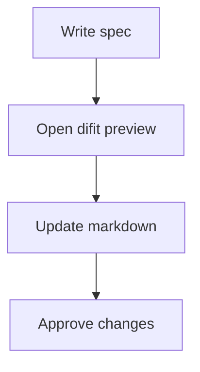
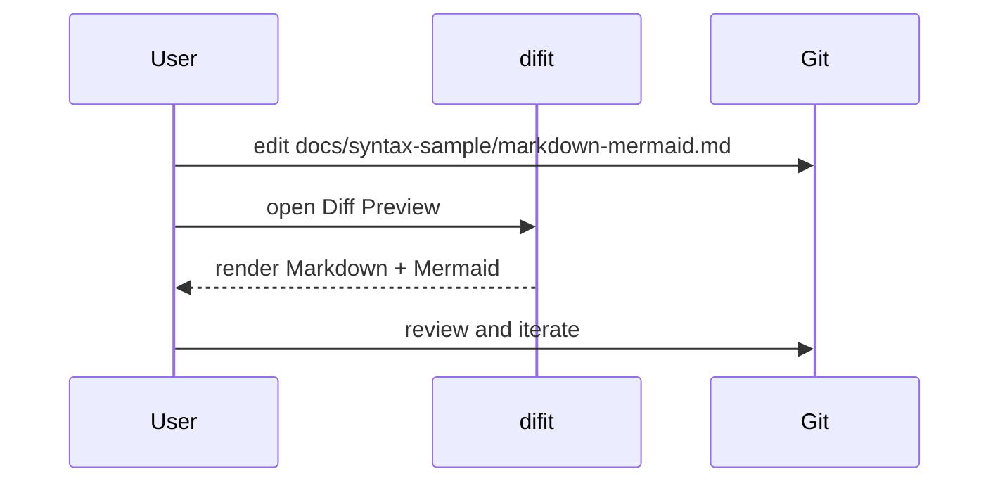
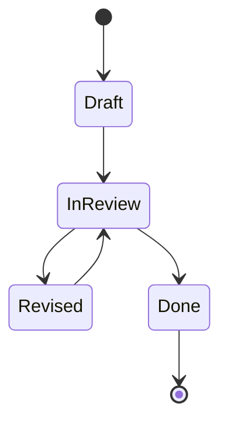

# Markdown Mermaid Preview Sample

This file is for checking `Diff Preview` and `Full Preview` rendering with Mermaid diagrams.

## Checklist

- [x] Headings
- [x] Paragraphs
- [x] GFM task list
- [x] Tables
- [x] Mermaid flowchart
- [x] Mermaid sequence diagram
- [x] Mermaid state diagram

## Flowchart

The diagram below is a simple review flow.

## Sequence Diagram

This one is useful for checking wider diagrams and labels.

## State Diagram

## GFM Table

| Item | Purpose | Status |
| :--- | :------ | :----- |
| Flowchart | Basic Mermaid rendering | Ready |
| Sequence | Wide layout check | Ready |
| State | Alternative diagram syntax | Ready |

## Change Ideas

If you want to exercise `Diff Preview`, try changing one of these:

1. Rename `Write spec` to `Write test spec`
2. Add one more participant to the sequence diagram
3. Insert a new state between `Revised` and `Done`
